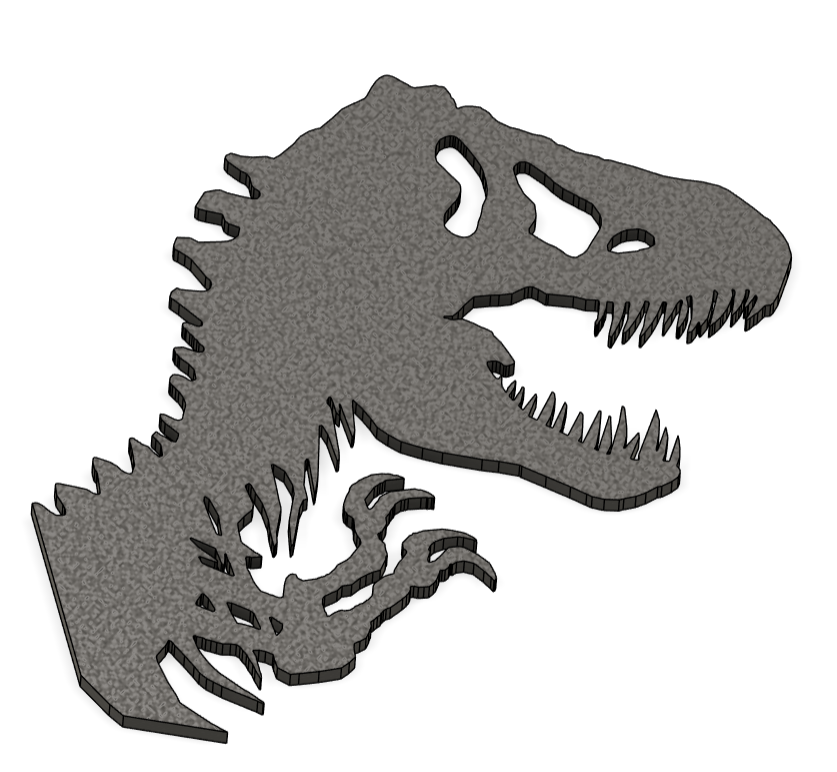
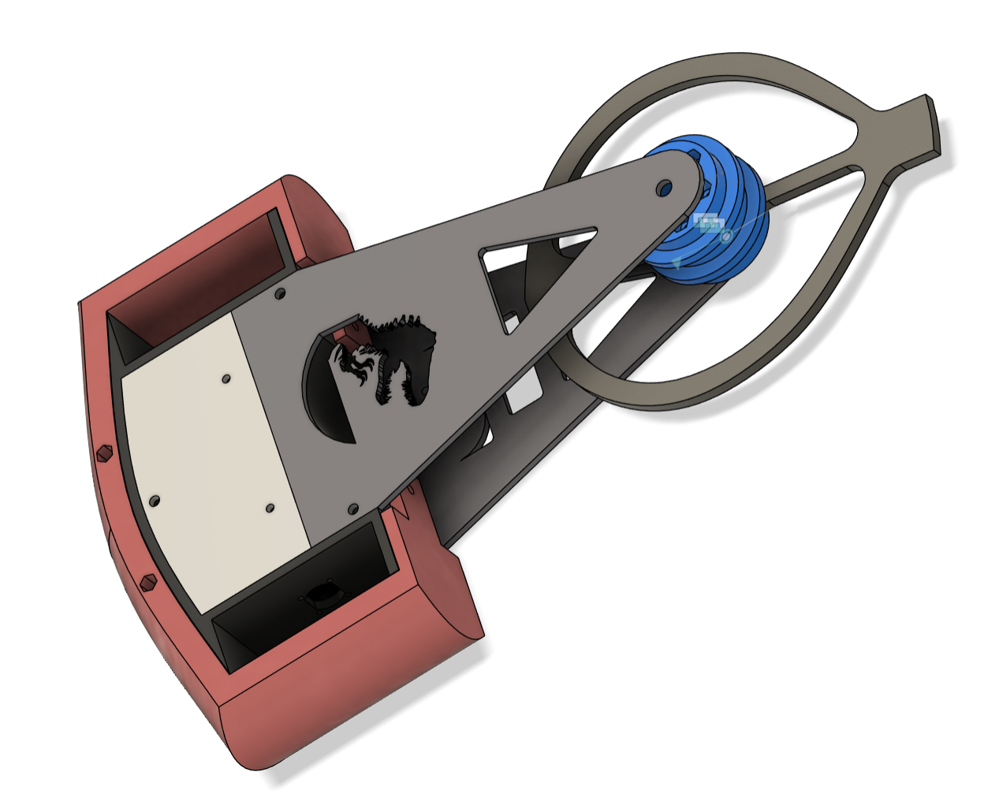
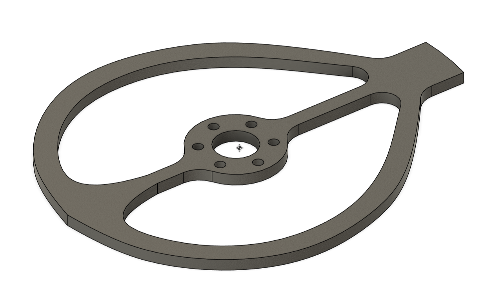
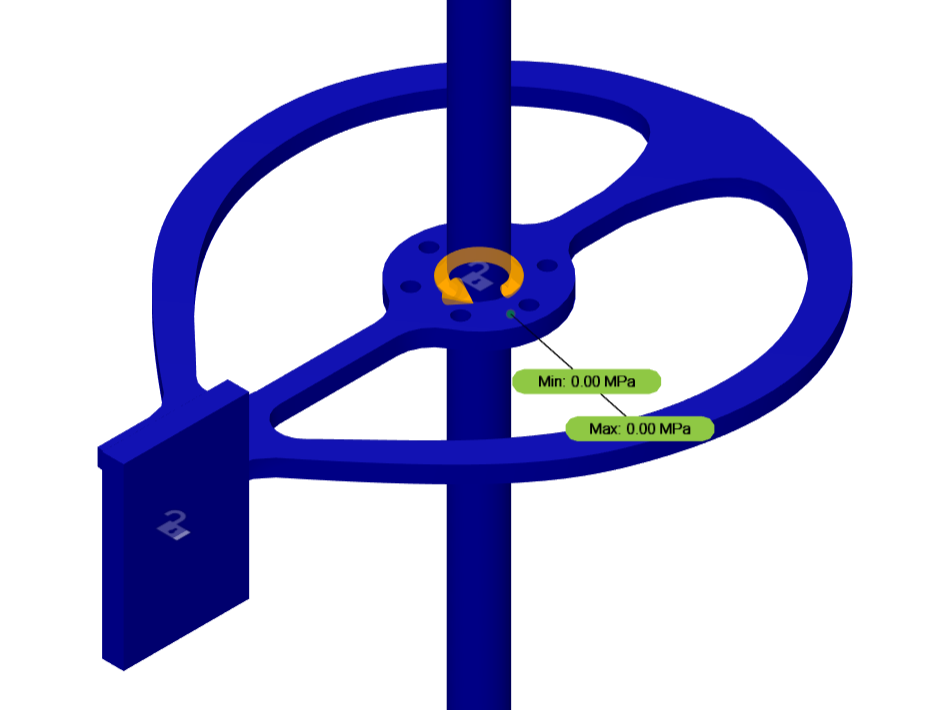
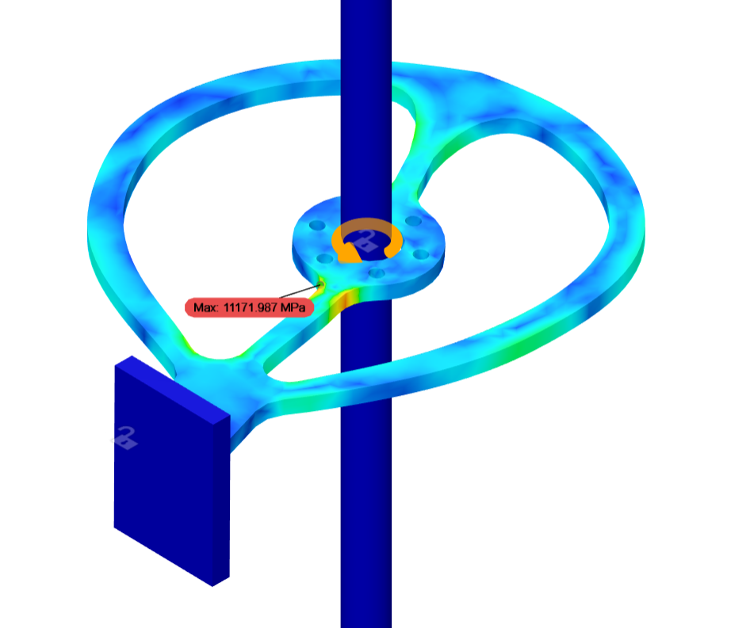
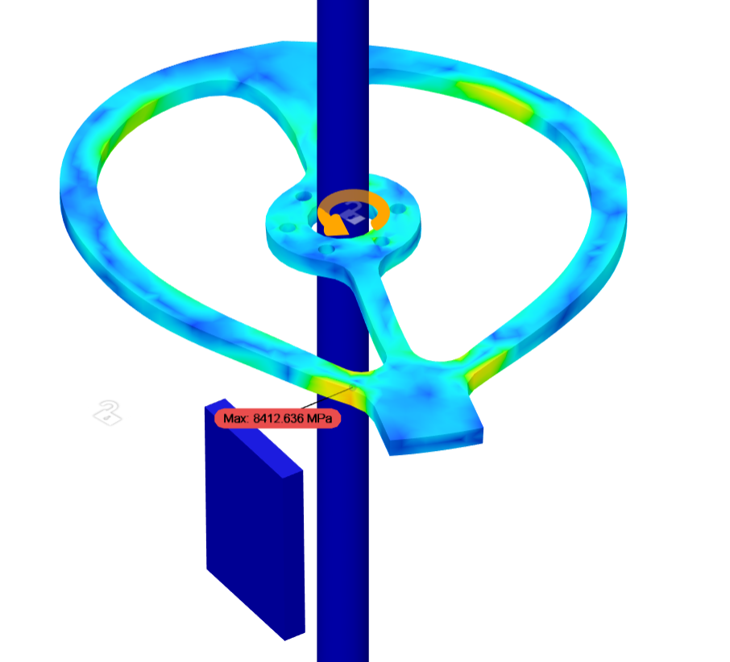
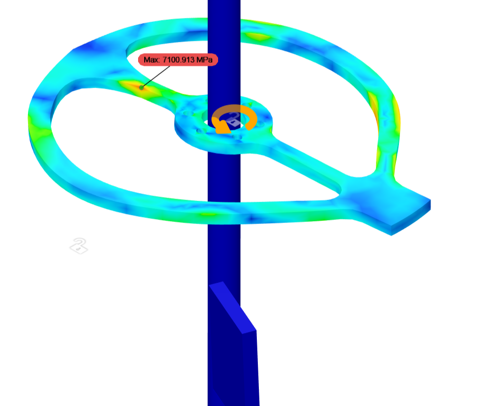
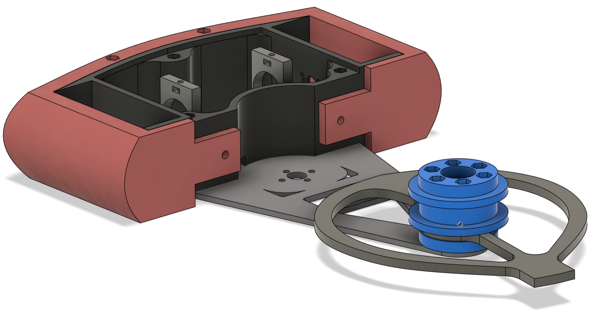

##  Featured Project: **Rexy** – My First BattleBot 

 
**Rexy** is my first step into the world of competitive combat robotics—where mechanical design, materials science, and control engineering meet head-on. 

It is a 3lb combat robot built for competitive BattleBots-style events. It features:

- 🌀 **Front Spinning Weapon**: Designed for maximum moment of inertia, maximizing destructive power within the 3lb weight limit. Designed to reduce high-stress points through Finite Element Analysis (FEA) simulations. 

  
  
  
  

- 🧠 **Optimized Weight Distribution**: Engineered for stability and impact delivery.

- 🛡️ **1-inch TPU Wraparound Armor**: Acts as a shock absorber, protecting critical internals while absorbing enemy hits.
- 🏗️ **Nylon-Enclosed Electronics Chamber**: Provides a durable, lightweight housing for the electronics and motors, ensuring second layer of protection from impact while maintaining optimal weight distribution.

# 🎥 Rexy Battle Videos

**Battle 1** 
[Rexy vs Dusty](https://www.youtube.com/watch?v=gOBiet8Y5_8&t=16745s)

**Battle 2** 
[Rexy vs Apex Predator](https://www.youtube.com/watch?v=gOBiet8Y5_8&t=20046s)

**Battle 3** 
[Rexy vs Dysfunctionals](https://www.youtube.com/watch?v=gOBiet8Y5_8&t=24045s)
